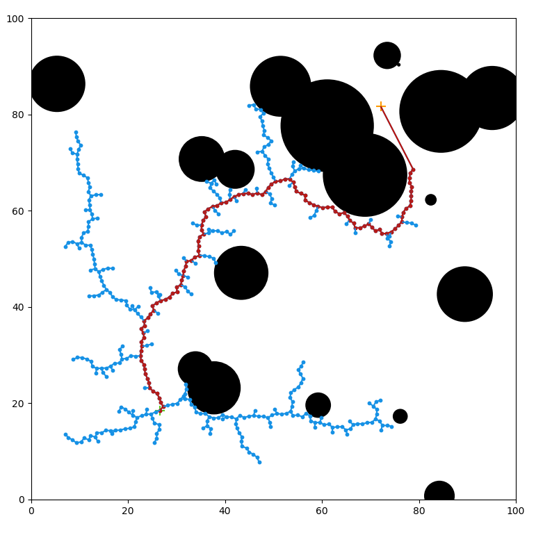

# RRT

This repository contains a series of programs that generate rapidly-exploring random trees (RRT). Explanation of RRT theory and program demonstration can be found [here](https://riley-knox.github.io/rrt/).

- RRT_one: generates an RRT of defined size that "explores" a space by expanding outwards. To execute this file, type

        ./RRT_one

in the command line and press ENTER.

- RRT_new: Python script generates an RRT that finds a path around obstacles to a goal. To execute, type

        ./RRT_new

in the command line and press ENTER.

 RRT successfully plots a path from start to end 

